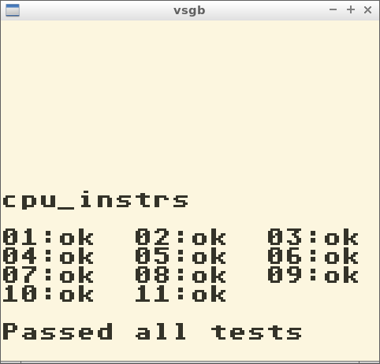

# vsgb
A simple Game Boy emulator writen in Python
## 

## Requirements
- Python >= 3.6 (pypy3 is recommended instead)
- PyOpenGL (https://pypi.org/project/PyOpenGL/)
- FreeGLUT (http://freeglut.sourceforge.net/)

## Running
The executable is:
- `python main.py` if you are running directly by Python script
* For performance, it is recommended to use [pypy3](https://pypy.org/) instead of python3

`executable -r romfile.gb`

### Parameters
- `-r` or `--rom` Specify the rom file
- `-d` or `--debug` Set logging to DEBUG and output to file
- `-s` or `--skip` Skip boot rom, let you go directly to rom
- `-c` or `--cgb` Game Boy Color mode

## Controller
- `Button A` <kbd> Z </kbd>
- `Button B` <kbd> X </kbd>
- `Button START` <kbd> Return ⏎ </kbd>
- `Button SELECT` <kbd> Backspace ⌫ </kbd>
- `Directional UP` <kbd> ↑ </kbd>
- `Directional DOWN` <kbd> ↓ </kbd>
- `Directional LEFT` <kbd> ← </kbd>
- `Directional RIGHT` <kbd> → </kbd>
- `Create Save State` <kbd> F4 </kbd>
- `Load Save State` <kbd> F5 </kbd>

## Coverage
- vsgb passed all cpu instruction tests

